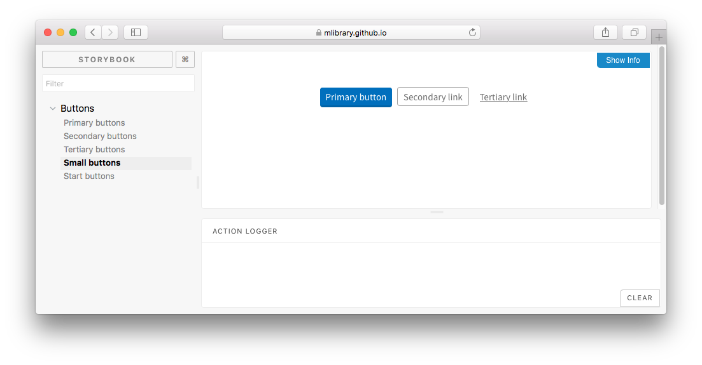

> Project in development

# Components build with React

Use these React components to make your service consistent with other library services. Learn from the research and experience of other teams and avoid repeating work that has already been done.

Use these components to make your interfaces consistent and accessible.

[View all the components](https://mlibrary.github.io/umich-lib-components-react/)



## Getting started

With npm

```
npm install
```

To run the Storybook locally

```
npm run storybook
```

To deploy the storybook

```
npm run deploy-storybook
```
